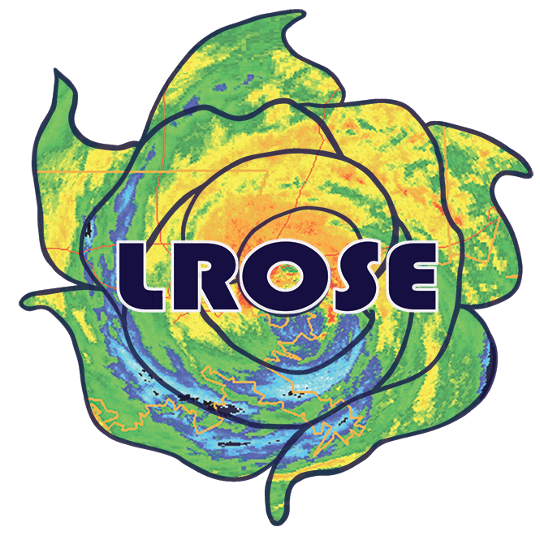

# lrose-elle

## **LROSE Elle** - The Lidar Radar Open Software Environment "Elle" Release

DOI coming soon

The third LROSE release is called **"Elle"** (a bright red rose) and encompasses six key toolsets that define a core lidar/radar workflow: *Convert, Display, QC, Grid, Echo, and Winds*

Elle can be installed in pre-compiled binary form or compiled from C++ source for native apps on Linux or Mac. Preliminary support is available for some tools on Windows.

Full documentation for Elle is available on the [LROSE wiki](https://wiki.lrose.net)

We encourage users to [register](https://lrose.net/software.html) in order to receive critical software updates, and sign up for the mailing list to help build the LROSE community.

[Help](https://lrose.net/help.html) can be obtained by posting issues directly to the lrose-blaze Github repository, via our help mailing list, or Discourse user forum.

LROSE is a co-operative project between:

  * [Dept. of Atmospheric Science at Colorado State University (CSU)](http://www.atmos.colostate.edu/) and the
  * [The Earth Observing Lab at the National Center for Atmospheric Research (NCAR)](https://www.eol.ucar.edu/content/lidar-radar-open-software-environment).

LROSE is funded by the [National Science Foundation](https://www.nsf.gov).

**Elle** focuses on high-quality, well-tested, well-maintained and well-documented key applications as ‘building blocks’, allowing users to assemble trusted, reproducible workflows to accomplish more complex scientific tasks.

In the current release, the following tools are available:

## Convert
  * **RadxPrint** - Query files to determine properties and support by the Radx engine
  * **RadxConvert** - Convert 24 different lidar and radar formats to CfRadial NetCDF format
  * **RadxBufr** - Convert Bufr format to CfRadial NetCDF format

## Display
  * **HawkEye** - Real-time and archive display suitable for both scanning and vertically pointing radars.

## Quality Control

  * **RadxDiffFields** - Compare two fields in different CfRadial files
  * **RadxDiffVol** - Compare two volumes in different CfRadial files
  * **RadxMergeFields** - Merge fields from different CfRadial files
  * **RadxFilter** - Perform simple filtering operations
  * **RadxPersistentClutter** - Create a mask for persistent ground clutter

## Grid
  * **Radx2Grid** - Gridding and interpolation of ground-based radar data
    * 3-D Cartesian gridding (x, y, z)
    * Cartesian PPIs (x, y, elevation)
    * Regular polar grid (range, azimuth, elevation)

## Echo
  * **RadxKdp** - KDP and Attenuation calculations
  * **RadxPid** - KDP, Attenuation, and Particle Identification
  * **RadxRate** - KDP, Attenuation, PID, and Rain Rate
  * **RadxQpe** - Accumulated Quantitative Precipitation Estimation

## Wind
  * **RadxEvad** - Extended Velocity Azimuth Display single-Doppler retrieval
  * **FRACTL** - Fast Reorder and CEDRIC Technique in LROSE multi-Doppler retrieval
  * **SAMURAI** - Variational multi-Doppler retrieval and analysis package
  * **VORTRAC** - Single-Doppler wind retrieval for vortices using the GBVTD or GVTD algorithms

### Future Release Plans

Elle is considered an 'unstable' release under active development.
The most recent stable release is "Cyclone".
